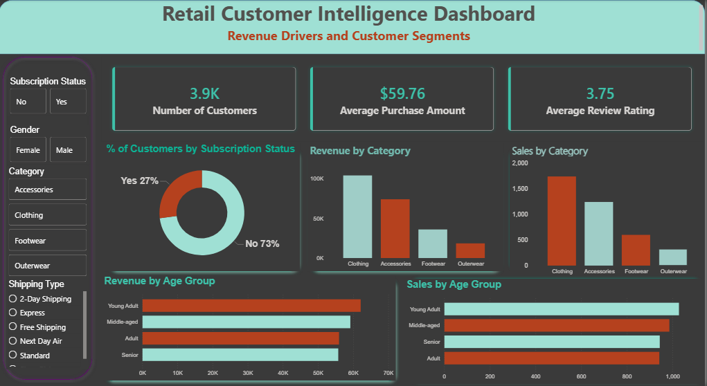

<p align="center">
  
</p>

<h1 align="center">🛍️ Retail Customer Intelligence Dashboard</h1>

<p align="center">
<b>Revenue Drivers and Customer Segments</b>
</p>

<p align="center">


</p>

---

# 📖 Project Overview

This project presents an end-to-end data analytics solution for a retail company using **Python, SQL, and Power BI**.

The objective is to analyze customer shopping behavior, identify revenue drivers, uncover customer segments, and transform raw retail transaction data into meaningful business insights that support data-driven decision-making.

---

# 🎯 Business Problem

A retail company wants to better understand customer purchasing behavior across product categories, customer demographics, and shopping seasons.

Without centralized analytics, marketing campaigns, inventory planning, and customer retention strategies rely on assumptions rather than data.

This project develops an interactive dashboard that enables stakeholders to monitor customer behavior, identify revenue opportunities, and make informed business decisions.

---

# 🛠️ Tech Stack

| Technology | Purpose |
|------------|----------|
| Python | Data Cleaning & Exploratory Data Analysis |
| Pandas | Data Manipulation |
| NumPy | Numerical Operations |
| SQL | Business Analysis |
| Power BI | Dashboard Development |
| Git & GitHub | Version Control |

---

# 📂 Dataset

- **Dataset:** Retail Customer Shopping Behavior Dataset
- **Transactions:** 3,900
- **Features:** 18 Columns
- **Format:** CSV

The dataset includes:

- Customer Demographics
- Product Category
- Purchase Amount
- Location
- Season
- Review Rating
- Subscription Status
- Shipping Type
- Payment Method
- Discount Applied
- Promo Code Usage
- Previous Purchases
- Purchase Frequency

---

# 📊 Dashboard Preview

<p align="center">
  
</p>

The Power BI dashboard provides an executive overview of customer purchasing behavior, revenue trends, and product performance through interactive visualizations and slicers.

---

# 📈 Dashboard Features

- Executive KPI Cards
- Revenue Analysis
- Customer Segmentation
- Product Category Performance
- Age & Gender Analysis
- Subscription Analysis
- Shipping Preference Analysis
- Payment Method Analysis
- Interactive Filters

---

# 📝 Business Questions Answered

- Which product categories generate the highest revenue?
- Which customer segment contributes the most sales?
- Do subscribers spend more than non-subscribers?
- Which payment methods are most preferred?
- Which shipping types are frequently selected?
- Which seasons generate the highest revenue?
- Which locations contribute the highest sales?
- How do discounts and promo codes influence customer spending?

---

# 💡 Key Insights

- Identified the highest revenue-generating product categories.
- Analyzed customer purchasing behavior across different age groups and genders.
- Evaluated the impact of subscription status on customer spending.
- Compared payment methods and shipping preferences.
- Discovered seasonal shopping trends to support inventory planning.
- Built an executive dashboard for interactive business analysis.

> **Note:** Update these insights with your actual findings after completing the analysis.

---

# 📈 Business Recommendations

- Focus marketing campaigns on high-value customer segments.
- Increase inventory for top-performing product categories.
- Strengthen subscription and customer loyalty initiatives.
- Optimize seasonal promotions using historical purchasing trends.
- Personalize marketing strategies based on customer behavior.

---

# 📁 Repository Structure

```
Retail-Customer-Intelligence-Dashboard
│
├── data
│   ├── raw
│   └── processed
│
├── notebooks
│
├── sql
│
├── powerbi
│
├── report
│
├── images
│
├── README.md
│
└── LICENSE
```

---

# 📷 Project Files

📁 **Data**
- Raw Dataset
- Processed Dataset

📁 **Python**
- Data Cleaning
- Exploratory Data Analysis

📁 **SQL**
- Business Queries
- Analytical Queries

📁 **Power BI**
- Interactive Dashboard (.pbix)

📁 **Report**
- Business Problem Statement
- Project Report
- Presentation

---

# 🚀 Future Enhancements

- Customer Lifetime Value (CLV) Analysis
- RFM Customer Segmentation
- Sales Forecasting
- Customer Churn Prediction
- Interactive Web Dashboard

---

# 👩‍💻 About Me

**Diksha C Pujari**

Aspiring Data Analyst

📧 Email: deekshawork2026@gmail.com

💼 LinkedIn: [Diksha Pujari](https://www.linkedin.com/in/diksha-pujari-819b75366)

💻 GitHub: [deekshajob05-hub](https://github.com/deekshajob05-hub)
---

<p align="center">

⭐ If you found this project interesting, consider giving it a Star!

</p>
